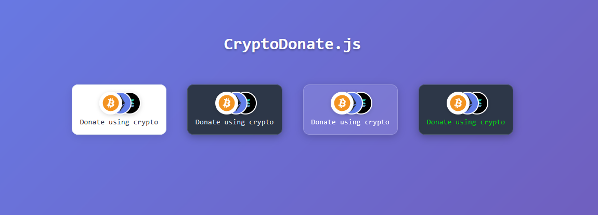
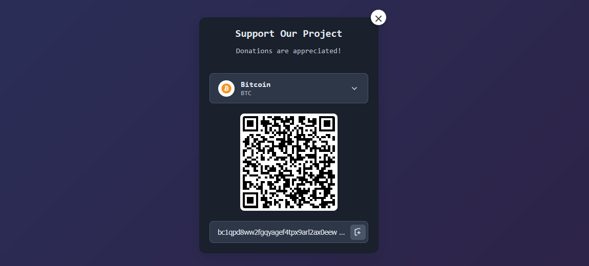

# CryptoDonate.js

A lightweight, customizable client-side cryptocurrency donation widget that's easy to embed on any website.

Accept donations in any cryptocurrency using QR codes and multiple themes.

## Showcase

[View HTML Example](https://pitz8.github.io/CryptoDonate/)




## Features

- **Zero Dependencies** - Pure vanilla JavaScript, no frameworks required
- **Multiple Themes** - Light, dark, and transparent glass themes
- **Responsive Design** - Works perfectly on desktop and mobile devices
- **Highly Customizable** - Customizable colors, titles, messages, and accent colors
- **Universal Crypto Support** - Supports any cryptocurrency with automatic icon fetching and fallback generation
- **One-Click Copy** - Copy wallet addresses with visual feedback
- **Privacy-First** - No tracking, no external API calls, fully client-side
- **Lightweight** - Minimal footprint, fast loading
- **Easy Integration** - Simple HTML custom elements

## Quick Start

1. Include the CSS and JS files:
```html
<link rel="stylesheet" href="cryptodonate.css">
<script src="cryptodonate.js"></script>
```

2. Add the widget to your HTML:
```html
<crypto-donate data-theme="light" data-title="Support Us" data-message="Your donations help us grow!">
    <btc>bc1qpd8ww2fgqyagef4tpx9arl2ax0eewcsezlxcu9</btc>
    <eth>0x7c6112ABeE69Ca5fAcC62005Aa08B3FDeC5Db3b1</eth>
    <sol>GJ4K1jyjXEby3FLHakp6TVi1aSMZbGrKqoCx67oKc4AF</sol>
</crypto-donate>
```

## Themes & Customization

### Available Themes
- **Light** - Clean white background with dark text
- **Dark** - Dark background with light text
- **Transparent** - Glassmorphism effect with backdrop blur

### Custom Colors
```html
<!-- Custom foreground color -->
<crypto-donate data-foreground="#00aa13" data-accent="#ff6b35">
    <btc>bc1qpd8ww2fgqyagef4tpx9arl2ax0eewcsezlxcu9</btc>
</crypto-donate>
```

### Supported Cryptocurrencies
**All cryptocurrencies are supported!** Simply use the crypto symbol as the tag name:
- `<btc>` - Bitcoin
- `<eth>` - Ethereum  
- `<sol>` - Solana
- `<usdt>` - Tether USD
- `<usdc>` - USD Coin
- `<ada>` - Cardano
- `<doge>` - Dogecoin
- `<matic>` - Polygon
- `<avax>` - Avalanche
- `<link>` - Chainlink
- `<any-crypto>` - Any cryptocurrency symbol

*The widget automatically fetches icons and generates appropriate styling for any cryptocurrency.*

## Configuration Options

| Attribute | Description | Default |
|-----------|-------------|---------|
| `data-theme` | Theme style: `light`, `dark`, `transparent` | `light` |
| `data-title` | Widget title text | `"Crypto Donation"` |
| `data-message` | Subtitle message | `"Your support is greatly appreciated!"` |
| `data-foreground` | Text color (hex or color name) | Theme default |
| `data-accent` | Accent color for highlights | `#007bff` |

## Examples

### Multi-crypto with custom styling
```html
<crypto-donate 
    data-theme="dark" 
    data-title="Support Our Project" 
    data-message="Every donation makes a difference!"
    data-accent="#4CAF50"
    data-foreground="#ffffff">
    <btc>bc1qpd8ww2fgqyagef4tpx9arl2ax0eewcsezlxcu9</btc>
    <eth>0x7c6112ABeE69Ca5fAcC62005Aa08B3FDeC5Db3b1</eth>
    <sol>GJ4K1jyjXEby3FLHakp6TVi1aSMZbGrKqoCx67oKc4AF</sol>
    <usdt>0x7c6112ABeE69Ca5fAcC62005Aa08B3FDeC5Db3b1</usdt>
    <usdc>0x7c6112ABeE69Ca5fAcC62005Aa08B3FDeC5Db3b1</usdc>
    <ada>addr1qx2fxv2umyhttkxyxp8x0dlpdt3k6cwng5pxj3jhsyd</ada>
    <doge>DH5yaieqoZN36fDVciNyRueRGvGLR3mr7L</doge>
</crypto-donate>
```

### Single currency with glassmorphism
```html
<crypto-donate 
    data-theme="transparent" 
    data-title="Bitcoin Only" 
    data-foreground="#ffffff">
    <btc>your-bitcoin-address</btc>
</crypto-donate>
```

## 🛠️ How It Works

The widget creates a small trigger button that opens a modal overlay when clicked. Users can:
1. Select their preferred cryptocurrency from the dropdown
2. View the QR code for easy mobile scanning
3. Copy the wallet address with one click
4. Close the modal when done

## Browser Support

- Chrome/Edge 63+
- Firefox 63+
- Safari 13+
- Modern mobile browsers

## License

MIT License - feel free to use in personal and commercial projects.

## Contributing

Contributions are welcome! Feel free to submit issues and pull requests.

---

**Made with ❤️ for the crypto community**